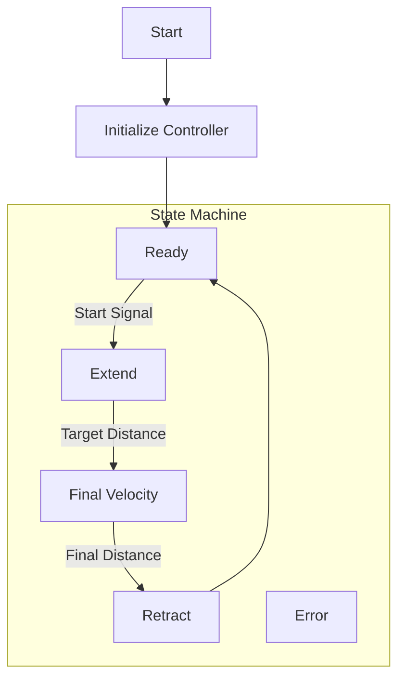

# Motion Control Simulation Demo in C++

## Overview

This repo is for a demo of motion controls of a linear actuator driving a mass with a spring in series in C++. The demo will include a simulated plant model of the system for Model in the Loop (MIL) testing to proof the controls are working properly before moving to Hardware in the Loop (HIL) testing or real hardware.

C++ object-oriented programming principles will be used to create the plant model and controls. The plant model and controls will be modular and reusable to scale up to multi-axis systems in the future. The modularity will also allow for easy testing and validation of the plant model and controls while keeping the controls separate from the plant model so no changes are needed to move the controls to Hardware in the Loop (HIL) testing or real hardware.

The system will comprise of:

- 'Through Rod' Stepper Motor Linear Actuator (Drive)
- 3D Printed Spring Component
- Carriage on a slide with ability to hold various masses (Cart)
- Position sensor to measure the position of the cart

The main function of the system will be to move the cart at a constant velocity over a distance away from the home position while minimizing oscillations in the spring. 

**Example Use Case:**
The user defined the cart must move at 10 mm/s between 50 and 60 mm away from the home position. Between 0 and 50 mm the user will optimize the system to traverse the distance as quickly as possible without overshooting the target velocity at 50 mm. Between 50 and 60 mm the system must maintain a steady velocity of 10 mm/s while minimizing oscillations in the spring.

## System Components Progress

### Existing Components

Fig. 1 - System Components


- **Application Logic Controller**: Raspberry Pi Compute Module 5 with I/O carrier board
- **Linear Actuator**: Through-Rod Stepper Motor Linear Actuator: [Spec Sheet](https://www.haydonkerkpittman.com/products/linear-actuators/hybrid-stepper/size-17)
- **Motor Driver**: DM542 Driver
- **Distance Sensor**: HC-SR04 Ultrasonic Sensor
- **Linear Slide**: THK

### Planned Components
- **Spring Component**: 3D Printed Spring Component
- **Carriage**: 3D Printed Cart to hold various masses
- **Microcontroller**: Pi Pico W for motor control and sensor interfacing (5V logic level)

## Plant Model

There will be a mathematical model of the plant in C++ that will simulate the behavior of the spring-mass system. The plant model will be discrete-time and will run at a fixed time step. The plant model will take in the control velocity as an input and output the cart velocity and position.

### Fig. 2 - Free Body Diagram


- m1 = mass
- k = spring constant
- v1 = velocity at drive (control velocity)
- v2 = velocity at cart (dependent velocity)

## Controls

The system must control the velocity at the cart. The controls must drive the cart at a user-defined target velocity at a target distance while minimizing oscillations in the spring.

### Requirements

- There will be a user-defined target velocity.
- There will be a user-defined target distance.
- The mass of the cart will be configurable.
- The spring constant and cart behavior will remain constant.
- The system must be able to reach a steady-state velocity with minimal oscillations in the spring.
- The controls should accommodate variances in distance, velocity, and mass.


## Model in Loop (MIL) Level 1

The MIL Level 1 test will evaluate the following functions:
- S-Curve motion
- Closed Loop Control with PID
- Extend to target distance
- Maintain target velocity
- Retract to home position

MIL Level 1 will not be used to optimize the gains of the controller; it is purely to ensure the implementation is correct for the basic functionality of the velocity control and motion profiles.


## MIL Level 2
The MIL Level 2 test will test the implementation of the state machine for the system. 

There will be the following states:
- **Ready**: System is idle and waiting for command at home position.
- **Extend**: System is extending to target distance.
- **Final_Velocity**: System is maintaining target velocity at target distance.
- **Retract**: System is retracting to home position.
- **Error**: System has encountered an error.

The state machine will be implemented in the main loop and will be tested in MIL Level 2 to ensure the transitions between states are working correctly. The main loop will use MIL Level 1 implementation as a starting point for the design. 

### main loop flow

## Build and Run

### Prerequisites

**Required:**
- CMake 3.10 or higher
- C++23 compatible compiler
- Python 3.x (for visualization scripts)

**Dependencies (automatically handled by CMake):**
- [GoogleTest](https://github.com/google/googletest) - Unit testing framework
- [Ruckig](https://github.com/pantor/ruckig) - Online trajectory generation library

**Python Packages (for visualization):**
```bash
pip install matplotlib numpy pandas
```

